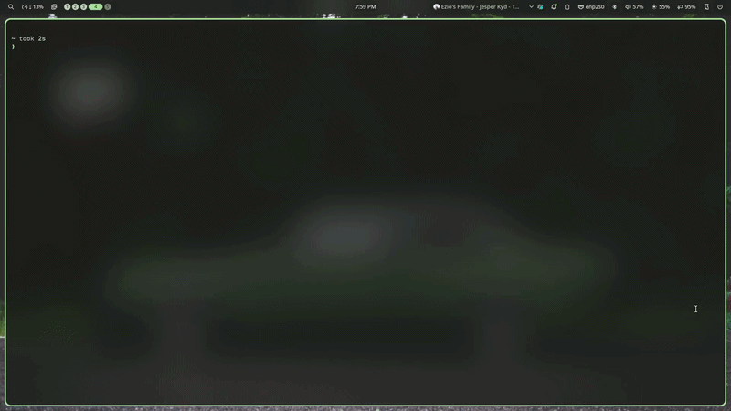

# Chip-8 Emu

Chip-8 Emulator is a fast and simple CLI Chip-8 emulator.
Just pass the file path to CMD and run!



## Installation

Use cargo to install this emulator!.

```bash
cargo install ch8_emu
```

## Features

- Supports all machine codes of base chip-8 emulator
- designed with OG gameboy color pallette
- super easy to use

## Usage

```bash
ch8 -f path/to/file.ch8
```

## License

[MIT](https://choosealicense.com/licenses/mit/)
